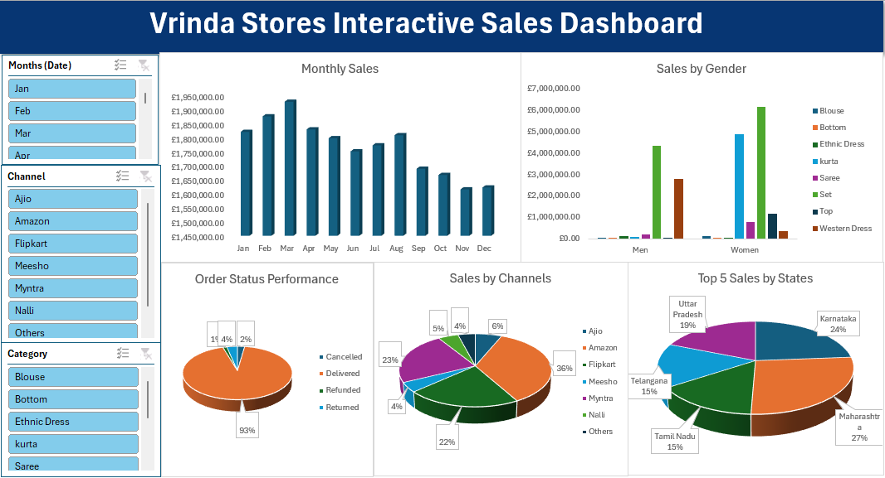

# Project 1
 
**Title:** [Vrinda Store Interactive Dashboard](https://github.com/loye80/loye80.github.io/blob/main/Vrindra%20Store%20DB.xlsx)
 
**Tools Used:** Microsoft Excel (Pivot Chart, Pivot tables, Conditional formating, filters, slicers, timelines)
 
**Project Description:**
 
**Key findings:**
 
**Dashboard Overview:**

# Project 2
**Title:** Employee Records Cleansing
 
**SQL Code:** [SQL queries](https://github.com/loye80/loye80.github.io/blob/main/Employee_data.sql)
 
**SQL Skills Used:**
 
**Project Description:**
 
 
**Technology used:** SQL server
